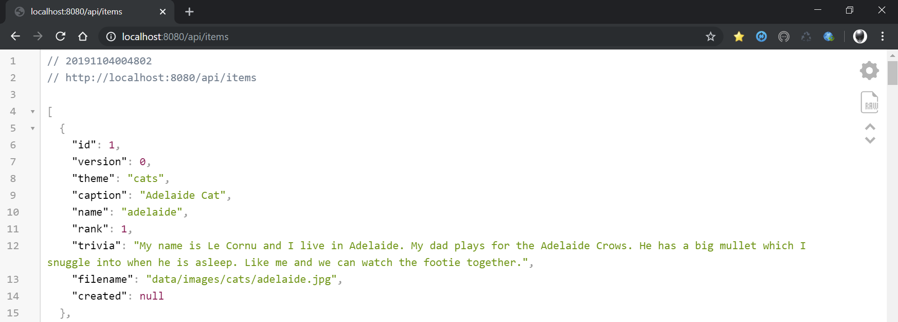

This project showcases a simple web app written using Java Spring Boot 1.5 and which exposes a Jersey REST web service which can be used for the ****Cat/City of the Day (COTD)**** Sample Project. This project uses older technology and has been DEPRECATED. Refer to the newer stack in the [EREBUS](https://github.com/advlab/erebus) Project